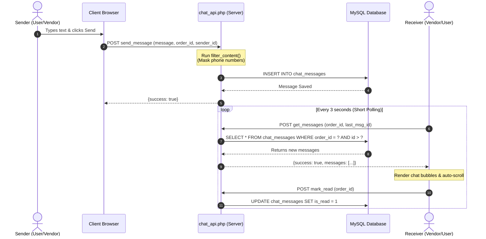
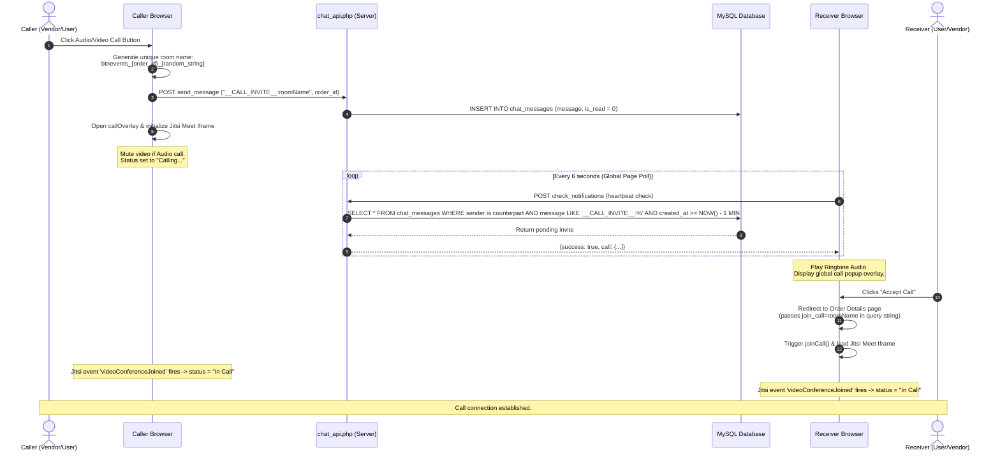

# Product Requirement Document (PRD): Real-time Order Chat & Video Calling System

This document outlines the current state and proposed improvements for the order chat and audio/video calling system deployed across the Surprise Ville customer portal and vendor portal.

---

## 1. Executive Summary & Goals

The Order Chat and Video Calling system is a critical bridge between customers and decorators (vendors). It enables real-time coordination during the life-cycle of a booking—helping resolve decoration preferences, spot details, color customization, and delivery updates.

### Primary Objectives:
- **Improve Fulfillment Quality**: Allow vendors and customers to exchange direct specifications to match visual expectations.
- **Secure Communication**: Protect against disintermediation (payments bypassing the portal) through message filtering.
- **Streamline Coordination**: Support instant voice/video connectivity to sort issues on-site.
- **Maintain Reliability**: Deliver a lightweight messaging system that functions across multiple subdomains and portals.

---

## 2. Stakeholders & Target Audience

1. **Customers (Users)**: Access chat from their Order Details page via a responsive chat modal. Need simple notifications when the vendor texts or calls.
2. **Vendors (Decorators/Partners)**: Access chat via a dedicated chat page (`order-chat.php`) in their partner panel. Need high reliability while on-site.
3. **Site Administrators**: Require access to chat histories and logs (`admin_chat_api.php`) for resolving payment disputes, quality complaints, or cancellation reviews.

---

## 3. Current System Architecture

The chat functions as a decoupled architecture where both client applications (Customer and Vendor portals) read from and write to a single centralized database via a core AJAX endpoint.

```
       [ Vendor Portal ]               [ Customer Portal ]
   (partners.surpriseville.co.in)    (surpriseville.co.in)
                 \                         /
                  \                       /
             (POST) \                   / (POST)
                     v                 v
            [ Core AJAX API: chat_api.php ]
                           |
                           v
              [ Database: chat_messages ]
```

### 3.1. Database Schema
Stored in the main database (`surpriseville_emp`), the `chat_messages` table structures each message:

| Column Name | Data Type | Null | Key | Default | Description |
| :--- | :--- | :--- | :--- | :--- | :--- |
| `id` | `int(11)` | NO | PRI | NULL | Auto-incrementing unique message ID |
| `order_id` | `int(11)` | NO | | NULL | Links message to a specific order |
| `sender_type`| `enum('user','vendor')` | NO | | NULL | Identifies if sender is customer or decorator |
| `sender_id` | `int(11)` | NO | | NULL | User ID or Vendor ID |
| `message` | `text` | NO | | NULL | Message body (filtered plain text or Jitsi room link) |
| `is_read` | `tinyint(1)` | YES | | `0` | Read receipt indicator (`0` = unread, `1` = read) |
| `created_at` | `timestamp` | NO | | `CURRENT_TIMESTAMP` | Timestamp of message delivery |

> [!WARNING]
> **Indexing Deficit**: The table currently has **no database indexes** on `order_id`, `sender_id`, or `is_read`. As the database grows, querying history per order will trigger full table scans, resulting in severe database bottlenecks.

---

## 4. System Flows & Flowcharts

The system operates via two primary channels: **Message Delivery** (short-polling based) and **Call Signaling** (via Jitsi Meet external wrapper).

### 4.1. Message Delivery & Read Receipts Flow
This flow details how text messages are validated, saved, and retrieved via client-side polling.



---

### 4.2. Jitsi Audio/Video Call Signaling Flow
 Jitsi calls do not use separate WebRTC signaling servers. Instead, call invitations are passed through the chat table as a system command message prefixed with `__CALL_INVITE__:`.



---

## 5. Multi-Angle Brainstorming & Gap Analysis

We have analyzed the current setup from several design, security, and technical dimensions. Below is the structured analysis of loopholes, functional bottlenecks, and potential upgrades.

### 5.1. Security & Authentication Angle

> [!CAUTION]
> **Cross-Domain Authentication Bypass**:
> The core API `chat_api.php` permits cross-domain requests from the vendor subdomain. However, because sessions do not share cookies automatically, it relies on this fallback logic:
> ```php
> if (!$is_vendor && in_array($request_origin, $allowed_origins)) {
>     if (isset($_POST['vendor_id'])) {
>         $is_vendor = true;
>     }
> }
> ```
> This is a **major security vulnerability**. Anyone can forge a client request with a spoofed origin header containing an arbitrary `vendor_id` parameter. The server will trust this request and allow reading or sending messages for that vendor.

#### Recommended Solutions:
- **Wildcard Session Cookies**: Update the session configuration to share cookies across subdomains by adding `ini_set('session.cookie_domain', '.surpriseville.co.in')` to database configuration files. This validates session cookies securely on both portals.
- **Signed Tokens (JWT)**: Generate a unique cryptographically signed token (containing order ID, user type, and ID) whenever a chat is initialized, and send this token in the headers of all API calls.

---

### 5.2. Performance & Scale Angle

- **Short Polling Overhead**: The 3-second messages polling, 10-second status polling, and 6-second global notification polling query the database continuously.
  - *Current Load calculation*: With 100 concurrent users active, the server receives over **3,000 HTTP requests per minute**, executing 3,000 select queries. This consumes CPU cycles and limits server scalability.
- **Lack of Database Indexes**: The database performs full-table sequential scans when querying `order_id` or checking `is_read`.
- **First Load Pagination**: The system loads the *entire* chat history on first load (`id > 0`). If an order has 500 messages, all 500 are fetched, serialized, and rendered in DOM, causing significant mobile browser lagging.

#### Recommended Solutions:
- **Introduce Indexing**: Add database indexes to speed up the polling queries:
  ```sql
  ALTER TABLE chat_messages ADD INDEX idx_order_id_id (order_id, id);
  ALTER TABLE chat_messages ADD INDEX idx_unread (sender_id, sender_type, is_read);
  ```
- **WebSockets / Server-Sent Events (SSE)**: Transition from HTTP polling to WebSockets (e.g. Socket.io, PHP Ratchet) or SSE. This allows the server to push updates only when a message is added.
- **Exponential Polling Backoff**: As a short-term fallback, implement client-side smart polling. If no new message arrives for 3 successive polls, double the polling interval (3s -> 6s -> 12s -> 20s). Reset to 3s immediately when the current user types, focus returns to the window, or a message is received.

---

### 5.3. User Experience (UX) & Interface (UI) Angle

- **No Media Support**: Chat is strictly limited to text. Vendors (decorators) frequently need to send images of balloon colors, venue layout options, or completed setups. Customers need to share visual reference ideas.
- **No Typing Indicators**: Users do not know if the other person is active or typing, which leads to double texts or frustration.
- **Calling Status Desync**: Since calls are simple iframe loads, there is no signaling context:
  - If the receiver clicks **Decline**, the caller's interface is never notified. The caller stays stuck on "Calling..." or "Ringing..." inside their Jitsi iframe alone until they manually end the call.
  - If the caller ends the call, the receiver's phone keeps ringing if they haven't opened the page yet.

#### Recommended Solutions:
- **Introduce Media Attachments**: Extend the input panel with an attachment button (handling image compression and upload). The database must be modified to support a `message_type` column (`'text'`, `'image'`, `'file'`).
- **Typing Indicator**: Update status updates. When a user focuses the text field, send a "typing" heartbeat to the API and render a typing bubble on the recipient's UI.
- **Complete Call Signaling Events**: Introduce system message cues:
  - `__CALL_DECLINED__:{roomName}`: Sent when a user declines, shutting down the caller's overlay and displaying "Call declined".
  - `__CALL_ENDED__:{roomName}`: Sent when either party clicks Hang Up, closing the overlay on both ends.

---

### 5.4. Business & Operations Angle

- **Disintermediation Vulnerabilities**: The phone number mask checks only consecutive sequences of 10 or more digits (`pattern = /(\d[\s-]?){10,}/`).
  - Users easily bypass this by writing: `"Nine eight seven six..."`, `"98 765 432 10"`, or by typing email addresses and direct WhatsApp click links.
- **Lack of Dispute Resolution UI for Admins**: Although admins can query the DB or run deletion APIs, they lack an elegant visual timeline inside the admin dashboard to review communication when resolving payment disputes.

#### Recommended Solutions:
- **Advanced Content Masking**: Extend the filter to block:
  - Text-written numbers ("nine", "eight", etc.).
  - Email addresses (standard regex patterns).
  - Common social domains (e.g., instagram.com, facebook.com, direct links).
- **Security Banners**: Add a persistent helper text in the chat input area:
  > [!IMPORTANT]
  > **Transaction Protection**: To keep your booking insured and secure refund eligibility, do not share phone numbers, social handles, or request offline payments. All coordination must happen within this chat.
- **Offline WhatsApp Failover**: If `last_seen` indicates the recipient has been offline for more than 2 minutes, route the message notification directly to WhatsApp using the existing `whatsapp_helper.php` framework:
  *"Decorators: [User Name] sent you a message about Order #[ID]. View and reply here: [Link]"*.

---

## 6. Enhancement Roadmap & Action Items

```
 ┌─────────────────────────────────────────────────────────────┐
 │                    PHASE 1: STABILITY & SECURITY            │
 │                    - Wildcard Session Sharing               │
 │                    - Database Indexing                      │
 │                    - Exponential Polling Backoff            │
 └──────────────────────────────┬──────────────────────────────┘
                                │
                                v
 ┌─────────────────────────────────────────────────────────────┐
 │                    PHASE 2: ENHANCED INTERACTION            │
 │                    - Call Signaling (End / Decline)         │
 │                    - Media / Image Attachments              │
 │                    - Transaction Safety Banner              │
 └──────────────────────────────┬──────────────────────────────┘
                                │
                                v
 ┌─────────────────────────────────────────────────────────────┐
 │                    PHASE 3: NEXT-GEN UPGRADE                │
 │                    - WebSocket Real-time Migration          │
 │                    - WhatsApp Offline Failovers             │
 │                    - Admin Dispute Chat Viewer UI           │
 └─────────────────────────────────────────────────────────────┘
```

---

### Phase 1 Detail: Database Indexes Definition
To optimize polling execution immediately, execute the following SQL patch on the main database:

```sql
-- 1. Optimizing message lookup and polling
ALTER TABLE `chat_messages` ADD INDEX `idx_order_messages` (`order_id`, `id`);

-- 2. Optimizing notification badge and unread counts query
ALTER TABLE `chat_messages` ADD INDEX `idx_unread_sender` (`sender_id`, `sender_type`, `is_read`);

-- 3. Optimizing user active/inactive queries
ALTER TABLE `users` ADD INDEX `idx_users_last_seen` (`last_seen`);
ALTER TABLE `vendors` ADD INDEX `idx_vendors_last_seen` (`last_seen`);
```
